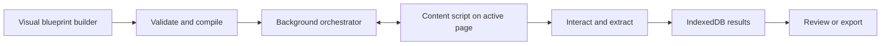

<div align="center">
  

  # OctoGrab

  **A visual workflow engine for reliable, no-code web data extraction.**

  Build reusable browser automations from composable blocks, run them directly against live pages, and export structured results without writing scraper scripts.
</div>

> [!NOTE]
> OctoGrab is under active development. This repository showcases the product architecture, execution engine, browser integration, and testing strategy.

## Why OctoGrab?

Most scraping tools force users to choose between one-off browser actions and custom code that is expensive to maintain. OctoGrab turns browser automation into a reusable visual model called a **blueprint**.

A blueprint can navigate between pages, interact with elements, extract structured records, branch on conditions, iterate over repeated content, paginate through results, and compose shared workflows as macros. Before execution, OctoGrab validates and compiles the blueprint so configuration problems can be reported early and runtime behavior remains observable.

## Highlights

- **Visual blueprint builder** — compose and reorder automation blocks from a React side panel.
- **13 workflow primitives** — navigate, click, input, wait, scroll, go back, assert, condition, set variable, extract scope, loop elements, paginate, and run macros.
- **Guided extraction wizard** — build recoverable scraper drafts with selector feedback and preflight validation.
- **Context-aware selectors** — inspect page elements, validate selector cardinality, and target elements within nested loop scopes.
- **Structured control flow** — model branches, nested blocks, element loops, pagination, variables, retries, and timeouts.
- **Reusable macros** — extract repeated workflow sequences while enforcing recursion and execution-safety rules.
- **Local-first persistence** — store blueprints, execution data, and notifications in IndexedDB through Dexie.
- **Execution observability** — capture block, scope, variable, macro-stack, attempt, and error details in execution traces.
- **Portable results** — inspect extracted records in the side panel and export them as CSV or JSON.
- **Focused test suite** — 41 Vitest files cover compilation, validation, messaging, selectors, persistence, execution, macros, and UI behavior.

## How It Works



OctoGrab is split across the standard browser-extension boundaries:

1. The **side panel** manages the blueprint editor, wizard, saved workflows, execution state, and extracted data.
2. The **compiler and validator** convert the editable blueprint tree into an executable plan and surface actionable errors before a run.
3. The **background service worker** coordinates browser tabs and extension-level messaging.
4. The **content script** runs on the target page, owns selector tooling, and performs page-level interactions and extraction.
5. **Dexie/IndexedDB** persists blueprints and local application state across sessions.

## Tech Stack

| Area | Technology |
| --- | --- |
| Extension platform | WXT, Chrome Manifest V3 |
| Language | TypeScript |
| Interface | React 19, Tailwind CSS, Radix UI |
| State management | MobX |
| Validation | Zod |
| Persistence | Dexie / IndexedDB |
| Drag and drop | dnd-kit |
| Testing | Vitest |
| Package manager | Bun |

## Repository Structure

```text
octograb/
├── core/                         # Messaging, database, selector engine, and shared infrastructure
├── entrypoints/
│   ├── background.ts             # Extension service worker
│   ├── content.ts                # Page interaction and extraction runtime
│   ├── models/                   # Blueprint blocks, compiler, validator, and execution contracts
│   ├── sidepanel/                # React application and workflow editor
│   └── stores/                   # Builder, wizard, executor, license, and notification state
├── components/ui/                # Reusable interface primitives
├── tests/                        # Focused unit and behavior tests
├── landing-page/                 # Standalone product and documentation site
└── wxt.config.ts                 # Extension manifest and build configuration
```

## Getting Started

### Prerequisites

- [Bun](https://bun.sh/) installed locally
- A Chromium-based browser such as Google Chrome

### Install and run

```bash
git clone https://github.com/ayoub-sahraoui/octograb.git
cd octograb
bun install
cp .env.example .env
```

Set development mode in `.env`:

```dotenv
VITE_DEV_MODE=true
```

Then start the WXT development build:

```bash
bun dev
```

WXT opens a browser profile with the development extension installed. If you prefer to load a production build manually:

```bash
bun run build
```

Open `chrome://extensions`, enable **Developer mode**, choose **Load unpacked**, and select `.output/chrome-mv3`.

> [!IMPORTANT]
> `VITE_DEV_MODE` is a compile-time flag intended only for local development. Rebuild after changing it, and do not enable it in a production release.

## Quality Checks

Run the full local verification suite:

```bash
bun run compile
bun run test
bun run build
```

Run one focused test file while developing:

```bash
bun vitest run tests/blueprint-compiler.test.ts
```

## Engineering Notes

### Registry-driven workflow model

Every workflow primitive is defined through a central block registry. The registry connects serialization, validation rules, selector requirements, nesting behavior, and executor dispatch. This keeps the editor and runtime aligned when a new block type is introduced.

### Compile before execution

Editable blueprints contain nested, user-controlled configuration. OctoGrab validates that model and compiles it into a normalized execution plan before touching the page. The boundary makes configuration errors easier to explain and keeps runtime logic focused on execution.

### Scoped execution

Loops introduce an element scope, while conditions introduce separate child branches. Execution variables are similarly divided into explicit scopes. This allows nested workflows to resolve selectors and variables relative to the correct page element without leaking state between iterations.

### Reliability and diagnostics

Blocks support configurable error strategies, retries, delays, and maximum execution times. Preflight feedback catches invalid selectors and unsafe plans before a run, while structured trace details preserve the active block, DOM scope chain, variable snapshot, macro stack, retry attempt, and error context for diagnosis.

### Test strategy

The test suite concentrates on high-risk boundaries: blueprint compilation and validation, selector semantics, cross-context messaging, persistence, nested execution, timeouts, macro safety, and execution observability. UI-focused tests cover critical feedback and configuration states without coupling the entire suite to end-to-end browser automation.

## Responsible Use

OctoGrab is designed for legitimate automation and data portability. Users are responsible for following applicable laws, website terms, robots policies, access controls, rate limits, privacy requirements, and data-owner permissions. Do not use it to bypass authentication, authorization, anti-bot protections, or other technical safeguards.

## Author

Built and maintained by [Ayoub Sahraoui](https://github.com/ayoub-sahraoui).

